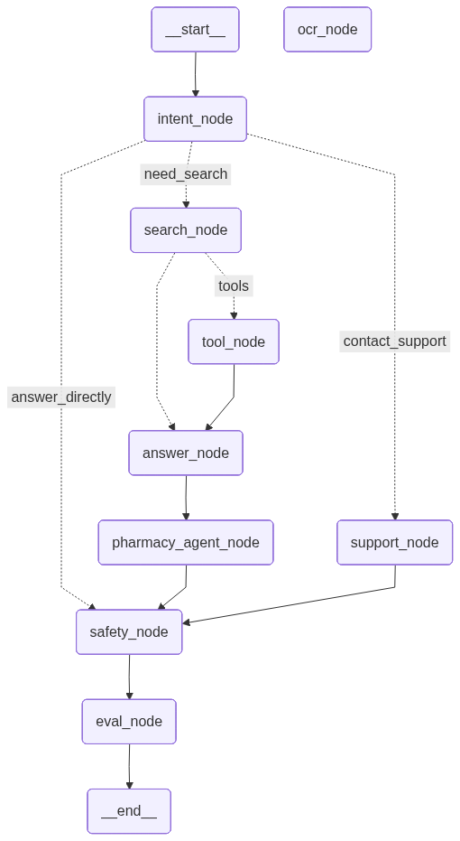
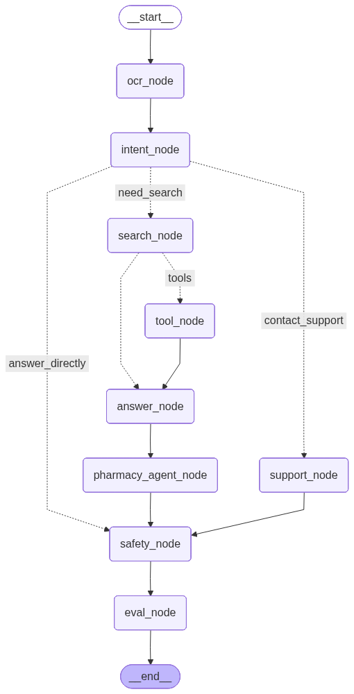

# AI powered Pharmacy Assistant

## Objective

Online pharmacy customers often struggle to compare medications, understand prescription requirements, and identify safe alternatives, leading to abandoned purchases and increased support requests. Our AI-powered assistant provides instant, trustworthy medication guidance by combining verified pharmacy data with real-time regulatory information. The result is a safer, more seamless shopping experience that boosts customer confidence, reduces support workload, and increases conversion rates.

## Demo Video
https://github.com/user-attachments/assets/5f43fa86-fd57-4f28-80ef-6bb440e49b0d

## Project Technologies:

- Langchain/Langgraph
- FastAPI
- PostgreSQL for SQL + Vector search
- Streamlit
- Ollama
- sentence-transformers and torch+cu126 (to speed up the embedding ingestion but you can you torch on cpu however it will take time to ingest the embeddings.)

## Model used:

- **llama3.2:3b** on Ollama
- **BAAI/bge-small-en-v1.5** from HaggineFace

  You can use any model you pefer on Ollama or even from LLM API prodivers like Gemini, OpenAI, Grok.
  make sure to:
  - Put the API key in the `.env` file
  - Set provider and model name in the `config.py` file
  - Install the correct langchain-modelprovider package

## Workflow Architecture:




## Steps to Run the Application

1. Clone the Repository
2. Create a `.env` file from the `.env.example` file in the root directory
3. Create virual environment using `python -m venv venv` and activate it
4. Install the required dependencies by running `pip install -r main_requriments.txt`
5. Dowload the dataset from [here](https://drive.google.com/file/d/1HhW5-VpNOczjoQgrAz6efgT0EsRBHS-K/view?usp=sharing) then put the dataset in the `data` folder.

### Database Setup

This project uses postgresql as its database on a docker container.
**The postgresql must have pgvector extension to support storing the vector embeddings.**

To create the docker container, use the following command:

```
docker run -d --name pgvector -e POSTGRES_USER=postgres -e POSTGRES_PASSWORD=your_password -e POSTGRES_DB=pharmacy_ai -p 5433:5432 -v pgdata:/var/lib/postgresql/data pgvector/pgvector:pg16
```

1. Check the connection of the database by running `python -m app.setup_database.db_engine`

2. If successful,

- run `python app\full_setup.py`

3. If **not** succesful,

- check the if docker container is running
- check the DATABASE_URL in the .env file make sure the database password is correct
